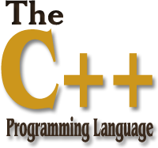

# C++ 教程

C++ 是一种中级语言，它是由 Bjarne Stroustrup 于 1979 年在贝尔实验室开始设计开发的。C++ 进一步扩充和完善了 C 语言，是一种面向对象的程序设计语言。C++ 可运行于多种平台上，如 Windows、MAC 操作系统以及 UNIX 的各种版本。

本教程通过通俗易懂的语言来讲解 C++ 编程语言。

**[现在开始学习 C++ 编程！](02_cpp-intro.md)**

[C++ 在线工具](http://www.runoob.com/try/showc.php?filename=helloworld&language=cpp)

## 谁适合阅读本教程？

本教程是专门为初学者打造的，帮助他们理解与 C++ 编程语言相关的基础到高级的概念。

## 阅读本教程前，您需要了解的知识：

在您开始练习本教程中所给出的各种实例之前，您需要对计算机程序和计算机程序设计语言有基本的了解。

## 编译/执行 C++ 程序

## 实例

```C++
#include <iostream>
using namespace std;

int main()
{
    cout << "Hello World";
    return 0;
}
```

[运行实例 »](http://www.runoob.com/try/showc.php?filename=helloworld&language=cpp)
