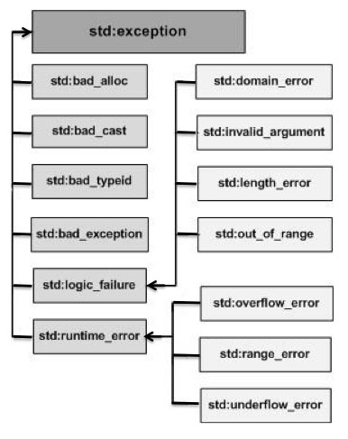

# C++ 异常处理

异常是程序在执行期间产生的问题。C++ 异常是指在程序运行时发生的特殊情况，比如尝试除以零的操作。

异常提供了一种转移程序控制权的方式。C++ 异常处理涉及到三个关键字： **try、catch、throw** 。

 * **throw:**  当问题出现时，程序会抛出一个异常。这是通过使用  **throw**  关键字来完成的。
 * **catch:**  在您想要处理问题的地方，通过异常处理程序捕获异常。 **catch**  关键字用于捕获异常。
 * **try:**  **try**  块中的代码标识将被激活的特定异常。它后面通常跟着一个或多个 catch 块。如果有一个块抛出一个异常，捕获异常的方法会使用  **try**  和  **catch**  关键字。try 块中放置可能抛出异常的代码，try 块中的代码被称为保护代码。使用 try/catch 语句的语法如下所示：

```C++
try
{
   // 保护代码
}catch( ExceptionName e1 )
{
   // catch 块
}catch( ExceptionName e2 )
{
   // catch 块
}catch( ExceptionName eN )
{
   // catch 块
}
```

如果  **try**  块在不同的情境下会抛出不同的异常，这个时候可以尝试罗列多个  **catch**  语句，用于捕获不同类型的异常。

## 抛出异常

您可以使用  **throw**  语句在代码块中的任何地方抛出异常。throw 语句的操作数可以是任意的表达式，表达式的结果的类型决定了抛出的异常的类型。

以下是尝试除以零时抛出异常的实例：

```C++
double division(int a, int b)
{
   if( b == 0 )
   {
      throw "Division by zero condition!";
   }
   return (a/b);
}
```

## 捕获异常

**catch**  块跟在  **try**  块后面，用于捕获异常。您可以指定想要捕捉的异常类型，这是由 catch 关键字后的括号内的异常声明决定的。

```C++
try
{
   // 保护代码
}catch( ExceptionName e )
{
  // 处理 ExceptionName 异常的代码
}
```

上面的代码会捕获一个类型为  **ExceptionName**  的异常。如果您想让 catch 块能够处理 try 块抛出的任何类型的异常，则必须在异常声明的括号内使用省略号 ...，如下所示：

```C++
try
{
   // 保护代码
}catch(...)
{
  // 能处理任何异常的代码
}
```

下面是一个实例，抛出一个除以零的异常，并在 catch 块中捕获该异常。

```C++
#include <iostream>
using namespace std;

double division(int a, int b)
{
   if( b == 0 )
   {
      throw "Division by zero condition!";
   }
   return (a/b);
}

int main ()
{
   int x = 50;
   int y = 0;
   double z = 0;
 
   try {
     z = division(x, y);
     cout << z << endl;
   }catch (const char* msg) {
     cerr << msg << endl;
   }

   return 0;
}
```

由于我们抛出了一个类型为  **const char***  的异常，因此，当捕获该异常时，我们必须在 catch 块中使用 const char*。当上面的代码被编译和执行时，它会产生下列结果：

```C++
Division by zero condition!
```

## C++ 标准的异常

C++ 提供了一系列标准的异常，定义在  **&lt;exception&gt;**  中，我们可以在程序中使用这些标准的异常。它们是以父子类层次结构组织起来的，如下所示：

下表是对上面层次结构中出现的每个异常的说明：

| 异常 | 描述 |
| ---- | ---- |
| **std::exception** | 该异常是所有标准 C++ 异常的父类。 |
| std::bad_alloc | 该异常可以通过  **new**  抛出。 |
| std::bad_cast | 该异常可以通过  **dynamic_cast**  抛出。 |
| std::bad_exception | 这在处理 C++ 程序中无法预期的异常时非常有用。 |
| std::bad_typeid | 该异常可以通过  **typeid**  抛出。 |
| **std::logic_error** | 理论上可以通过读取代码来检测到的异常。 |
| std::domain_error | 当使用了一个无效的数学域时，会抛出该异常。 |
| std::invalid_argument | 当使用了无效的参数时，会抛出该异常。 |
| std::length_error | 当创建了太长的 std::string 时，会抛出该异常。 |
| std::out_of_range | 该异常可以通过方法抛出，例如 std::vector 和 std::bitset&lt;&gt;::operator[]()。 |
| **std::runtime_error** | 理论上不可以通过读取代码来检测到的异常。 |
| std::overflow_error | 当发生数学上溢时，会抛出该异常。 |
| std::range_error | 当尝试存储超出范围的值时，会抛出该异常。 |
| std::underflow_error | 当发生数学下溢时，会抛出该异常。 |

## 定义新的异常

您可以通过继承和重载  **exception**  类来定义新的异常。下面的实例演示了如何使用 std::exception 类来实现自己的异常：

```C++
#include <iostream>
#include <exception>
using namespace std;

struct MyException : public exception
{
  const char * what () const throw ()
  {
    return "C++ Exception";
  }
};
 
int main()
{
  try
  {
    throw MyException();
  }
  catch(MyException& e)
  {
    std::cout << "MyException caught" << std::endl;
    std::cout << e.what() << std::endl;
  }
  catch(std::exception& e)
  {
    //其他的错误
  }
}
```

这将产生以下结果：

```C++
MyException caught
C++ Exception
```

在这里， **what()**  是异常类提供的一个公共方法，它已被所有子异常类重载。这将返回异常产生的原因。
