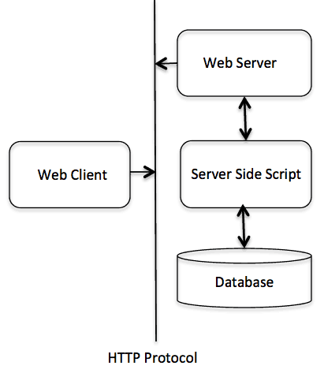

# C++ Web 编程

## 什么是 CGI？

 * 公共网关接口（CGI），是一套标准，定义了信息是如何在 Web 服务器和客户端脚本之间进行交换的。
 * CGI 规范目前是由 NCSA 维护的，NCSA 定义 CGI 如下：
 * 公共网关接口（CGI），是一种用于外部网关程序与信息服务器（如 HTTP 服务器）对接的接口标准。
 * 目前的版本是 CGI/1.1，CGI/1.2 版本正在推进中。## Web 浏览

为了更好地了解 CGI 的概念，让我们点击一个超链接，浏览一个特定的网页或 URL，看看会发生什么。

 * 您的浏览器联系上 HTTP Web 服务器，并请求 URL，即文件名。
 * Web 服务器将解析 URL，并查找文件名。如果找到请求的文件，Web 服务器会把文件发送回浏览器，否则发送一条错误消息，表明您请求了一个错误的文件。
 * Web 浏览器从 Web 服务器获取响应，并根据接收到的响应来显示文件或错误消息。然而，以这种方式搭建起来的 HTTP 服务器，不管何时请求目录中的某个文件，HTTP 服务器发送回来的不是该文件，而是以程序形式执行，并把执行产生的输出发送回浏览器显示出来。

公共网关接口（CGI），是使得应用程序（称为 CGI 程序或 CGI 脚本）能够与 Web 服务器以及客户端进行交互的标准协议。这些 CGI 程序可以用 Python、PERL、Shell、C 或 C++ 等进行编写。

## CGI 架构图

下图演示了 CGI 的架构：

## Web 服务器配置

在您进行 CGI 编程之前，请确保您的 Web 服务器支持 CGI，并已配置成可以处理 CGI 程序。所有由 HTTP 服务器执行的 CGI 程序，都必须在预配置的目录中。该目录称为 CGI 目录，按照惯例命名为 /var/www/cgi-bin。虽然 CGI 文件是 C++ 可执行文件，但是按照惯例它的扩展名是  **.cgi** 。

默认情况下，Apache Web 服务器会配置在 /var/www/cgi-bin 中运行 CGI 程序。如果您想指定其他目录来运行 CGI 脚本，您可以在 httpd.conf 文件中修改以下部分：

```C++
<Directory "/var/www/cgi-bin">
   AllowOverride None
   Options ExecCGI
   Order allow,deny
   Allow from all
</Directory>
 
<Directory "/var/www/cgi-bin">
Options All
</Directory>
```

在这里，我们假设已经配置好 Web 服务器并能成功运行，你可以运行任意的 CGI 程序，比如 Perl 或 Shell 等。

## 第一个 CGI 程序

请看下面的 C++ 程序：

```C++
#include <iostream>
using namespace std;
 
int main ()
{
    
   cout << "Content-type:text/html\r\n\r\n";
   cout << "<html>\n";
   cout << "<head>\n";
   cout << "<title>Hello World - 第一个 CGI 程序</title>\n";
   cout << "</head>\n";
   cout << "<body>\n";
   cout << "<h2>Hello World! 这是我的第一个 CGI 程序</h2>\n";
   cout << "</body>\n";
   cout << "</html>\n";
   
   return 0;
}
```

编译上面的代码，把可执行文件命名为 cplusplus.cgi，并把这个文件保存在 /var/www/cgi-bin 目录中。在运行 CGI 程序之前，请使用  **chmod 755 cplusplus.cgi**  UNIX 命令来修改文件模式，确保文件可执行。访问可执行文件，您会看到下面的输出：

## Hello World! 这是我的第一个 CGI 程序

上面的 C++ 程序是一个简单的程序，把它的输出写在 STDOUT 文件上，即显示在屏幕上。在这里，值得注意一点，第一行输出  **Content-type:text/html\r\n\r\n** 。这一行发送回浏览器，并指定要显示在浏览器窗口上的内容类型。您必须理解 CGI 的基本概念，这样才能进一步使用 Python 编写更多复杂的 CGI 程序。C++ CGI 程序可以与任何其他外部的系统（如 RDBMS）进行交互。

## HTTP 头信息

行  **Content-type:text/html\r\n\r\n**  是 HTTP 头信息的组成部分，它被发送到浏览器，以便更好地理解页面内容。HTTP 头信息的形式如下：

```C++
HTTP 字段名称: 字段内容
 
例如
Content-type: text/html\r\n\r\n
```

还有一些其他的重要的 HTTP 头信息，这些在您的 CGI 编程中都会经常被用到。

| 头信息 | 描述 |
| ---- | ---- |
| Content-type: | MIME 字符串，定义返回的文件格式。例如 Content-type:text/html。 |
| Expires: Date | 信息变成无效的日期。浏览器使用它来判断一个页面何时需要刷新。一个有效的日期字符串的格式应为 01 Jan 1998 12:00:00 GMT。 |
| Location: URL | 这个 URL 是指应该返回的 URL，而不是请求的 URL。你可以使用它来重定向一个请求到任意的文件。 |
| Last-modified: Date | 资源的最后修改日期。 |
| Content-length: N | 要返回的数据的长度，以字节为单位。浏览器使用这个值来表示一个文件的预计下载时间。 |
| Set-Cookie: String | 通过  _string_  设置 cookie。 |

## CGI 环境变量

所有的 CGI 程序都可以访问下列的环境变量。这些变量在编写 CGI 程序时扮演了非常重要的角色。

| 变量名 | 描述 |
| ---- | ---- |
| CONTENT_TYPE | 内容的数据类型。当客户端向服务器发送附加内容时使用。例如，文件上传等功能。 |
| CONTENT_LENGTH | 查询的信息长度。只对 POST 请求可用。 |
| HTTP_COOKIE | 以键 &amp; 值对的形式返回设置的 cookies。 |
| HTTP_USER_AGENT | 用户代理请求标头字段，递交用户发起请求的有关信息，包含了浏览器的名称、版本和其他平台性的附加信息。 |
| PATH_INFO | CGI 脚本的路径。 |
| QUERY_STRING | 通过 GET 方法发送请求时的 URL 编码信息，包含 URL 中问号后面的参数。 |
| REMOTE_ADDR | 发出请求的远程主机的 IP 地址。这在日志记录和认证时是非常有用的。 |
| REMOTE_HOST | 发出请求的主机的完全限定名称。如果此信息不可用，则可以用 REMOTE_ADDR 来获取 IP 地址。 |
| REQUEST_METHOD | 用于发出请求的方法。最常见的方法是 GET 和 POST。 |
| SCRIPT_FILENAME | CGI 脚本的完整路径。 |
| SCRIPT_NAME | CGI 脚本的名称。 |
| SERVER_NAME | 服务器的主机名或 IP 地址。 |
| SERVER_SOFTWARE | 服务器上运行的软件的名称和版本。 |

下面的 CGI 程序列出了所有的 CGI 变量。

```C++
#include <iostream>
#include <stdlib.h>
using namespace std;

const string ENV[ 24 ] = {                 
        "COMSPEC", "DOCUMENT_ROOT", "GATEWAY_INTERFACE",   
        "HTTP_ACCEPT", "HTTP_ACCEPT_ENCODING",             
        "HTTP_ACCEPT_LANGUAGE", "HTTP_CONNECTION",         
        "HTTP_HOST", "HTTP_USER_AGENT", "PATH",            
        "QUERY_STRING", "REMOTE_ADDR", "REMOTE_PORT",      
        "REQUEST_METHOD", "REQUEST_URI", "SCRIPT_FILENAME",
        "SCRIPT_NAME", "SERVER_ADDR", "SERVER_ADMIN",      
        "SERVER_NAME","SERVER_PORT","SERVER_PROTOCOL",     
        "SERVER_SIGNATURE","SERVER_SOFTWARE" };   

int main ()
{
    
   cout << "Content-type:text/html\r\n\r\n";
   cout << "<html>\n";
   cout << "<head>\n";
   cout << "<title>CGI 环境变量</title>\n";
   cout << "</head>\n";
   cout << "<body>\n";
   cout << "<table border = \"0\" cellspacing = \"2\">";

   for ( int i = 0; i < 24; i++ )
   {
       cout << "<tr><td>" << ENV[ i ] << "</td><td>";
       // 尝试检索环境变量的值
       char *value = getenv( ENV[ i ].c_str() );  
       if ( value != 0 ){
         cout << value;                                 
       }else{
         cout << "环境变量不存在。";
       }
       cout << "</td></tr>\n";
   }
   cout << "</table><\n";
   cout << "</body>\n";
   cout << "</html>\n";
   
   return 0;
}
```

## C++ CGI 库

在真实的实例中，您需要通过 CGI 程序执行许多操作。这里有一个专为 C++ 程序而编写的 CGI 库，我们可以从 [ftp://ftp.gnu.org/gnu/cgicc/](ftp://ftp.gnu.org/gnu/cgicc/) 上下载这个 CGI 库，并按照下面的步骤安装库：

```C++
$tar xzf cgicc-X.X.X.tar.gz 
$cd cgicc-X.X.X/ 
$./configure --prefix=/usr 
$make
$make install
```

您可以点击 [C++ CGI Lib Documentation](http://www.gnu.org/software/cgicc/doc/index.html)，查看相关的库文档。

## GET 和 POST 方法

您可能有遇到过这样的情况，当您需要从浏览器传递一些信息到 Web 服务器，最后再传到 CGI 程序。通常浏览器会使用两种方法把这个信息传到 Web 服务器，分别是 GET 和 POST 方法。

## 使用 GET 方法传递信息

GET 方法发送已编码的用户信息追加到页面请求中。页面和已编码信息通过 ? 字符分隔开，如下所示：

```C++
http://www.test.com/cgi-bin/cpp.cgi?key1=value1&key2=value2
```

GET 方法是默认的从浏览器向 Web 服务器传信息的方法，它会在浏览器的地址栏中生成一串很长的字符串。当您向服务器传密码或其他一些敏感信息时，不要使用 GET 方法。GET 方法有大小限制，在一个请求字符串中最多可以传 1024 个字符。

当使用 GET 方法时，是使用 QUERY_STRING http 头来传递信息，在 CGI 程序中可使用 QUERY_STRING 环境变量来访问。

您可以通过在 URL 后跟上简单连接的键值对，也可以通过使用 HTML &lt;FORM&gt; 标签的 GET 方法来传信息。

## 简单的 URL 实例：Get 方法

下面是一个简单的 URL，使用 GET 方法传递两个值给 hello_get.py 程序。

/cgi-bin/cpp_get.cgi?first_name=ZARA&amp;last_name=ALI

下面的实例生成  **cpp_get.cgi**  CGI 程序，用于处理 Web 浏览器给出的输入。通过使用 C++ CGI 库，可以很容易地访问传递的信息：

```C++
#include <iostream>
#include <vector>  
#include <string>  
#include <stdio.h>  
#include <stdlib.h> 

#include <cgicc/CgiDefs.h> 
#include <cgicc/Cgicc.h> 
#include <cgicc/HTTPHTMLHeader.h> 
#include <cgicc/HTMLClasses.h>  

using namespace std;
using namespace cgicc;

int main ()
{
   Cgicc formData;
   
   cout << "Content-type:text/html\r\n\r\n";
   cout << "<html>\n";
   cout << "<head>\n";
   cout << "<title>使用 GET 和 POST 方法</title>\n";
   cout << "</head>\n";
   cout << "<body>\n";

   form_iterator fi = formData.getElement("first_name");  
   if( !fi->isEmpty() && fi != (*formData).end()) {  
      cout << "名：" << **fi << endl;  
   }else{
      cout << "No text entered for first name" << endl;  
   }
   cout << "<br/>\n";
   fi = formData.getElement("last_name");  
   if( !fi->isEmpty() &&fi != (*formData).end()) {  
      cout << "姓：" << **fi << endl;  
   }else{
      cout << "No text entered for last name" << endl;  
   }
   cout << "<br/>\n";

   cout << "</body>\n";
   cout << "</html>\n";
   
   return 0;
}
```

现在，编译上面的程序，如下所示：

```C++
$g++ -o cpp_get.cgi cpp_get.cpp -lcgicc
```

生成 cpp_get.cgi，并把它放在 CGI 目录中，并尝试使用下面的链接进行访问：

/cgi-bin/cpp_get.cgi?first_name=ZARA&amp;last_name=ALI

这会产生以下结果：

```C++
名：ZARA 
姓：ALI 
```

## 简单的表单实例：GET 方法

下面是一个简单的实例，使用 HTML 表单和提交按钮传递两个值。我们将使用相同的 CGI 脚本 cpp_get.cgi 来处理输入。

```C++
<form action="/cgi-bin/cpp_get.cgi" method="get">
名：<input type="text" name="first_name">  <br />
 
姓：<input type="text" name="last_name" />
<input type="submit" value="提交" />
</form>
```

下面是上述表单的实际输出，请输入名和姓，然后点击提交按钮查看结果。

## 使用 POST 方法传递信息

一个更可靠的向 CGI 程序传递信息的方法是 POST 方法。这种方法打包信息的方式与 GET 方法相同，不同的是，它不是把信息以文本字符串形式放在 URL 中的 ? 之后进行传递，而是把它以单独的消息形式进行传递。该消息是以标准输入的形式传给 CGI 脚本的。

我们同样使用 cpp_get.cgi 程序来处理 POST 方法。让我们以同样的例子，通过使用 HTML 表单和提交按钮来传递两个值，只不过这次我们使用的不是 GET 方法，而是 POST 方法，如下所示：

```C++
<form action="/cgi-bin/cpp_get.cgi" method="post">
名：<input type="text" name="first_name"><br />
姓：<input type="text" name="last_name" />
 
<input type="submit" value="提交" />
</form>
```

## 向 CGI 程序传递复选框数据

当需要选择多个选项时，我们使用复选框。

下面的 HTML 代码实例是一个带有两个复选框的表单：

```C++
<form action="/cgi-bin/cpp_checkbox.cgi" 
         method="POST" 
         target="_blank">
<input type="checkbox" name="maths" value="on" /> 数学
<input type="checkbox" name="physics" value="on" /> 物理
<input type="submit" value="选择学科" />
</form>
```

下面的 C++ 程序会生成 cpp_checkbox.cgi 脚本，用于处理 Web 浏览器通过复选框给出的输入。

```C++
#include <iostream>
#include <vector>  
#include <string>  
#include <stdio.h>  
#include <stdlib.h> 

#include <cgicc/CgiDefs.h> 
#include <cgicc/Cgicc.h> 
#include <cgicc/HTTPHTMLHeader.h> 
#include <cgicc/HTMLClasses.h> 

using namespace std;
using namespace cgicc;

int main ()
{
   Cgicc formData;
   bool maths_flag, physics_flag;

   cout << "Content-type:text/html\r\n\r\n";
   cout << "<html>\n";
   cout << "<head>\n";
   cout << "<title>向 CGI 程序传递复选框数据</title>\n";
   cout << "</head>\n";
   cout << "<body>\n";

   maths_flag = formData.queryCheckbox("maths");
   if( maths_flag ) {  
      cout << "Maths Flag: ON " << endl;  
   }else{
      cout << "Maths Flag: OFF " << endl;  
   }
   cout << "<br/>\n";

   physics_flag = formData.queryCheckbox("physics");
   if( physics_flag ) {  
      cout << "Physics Flag: ON " << endl;  
   }else{
      cout << "Physics Flag: OFF " << endl;  
   }
   cout << "<br/>\n";
   cout << "</body>\n";
   cout << "</html>\n";
   
   return 0;
}
```

## 向 CGI 程序传递单选按钮数据

当只需要选择一个选项时，我们使用单选按钮。

下面的 HTML 代码实例是一个带有两个单选按钮的表单：

```C++
<form action="/cgi-bin/cpp_radiobutton.cgi" 
         method="post" 
         target="_blank">
<input type="radio" name="subject" value="maths" 
                                    checked="checked"/> 数学 
<input type="radio" name="subject" value="physics" /> 物理
<input type="submit" value="选择学科" />
</form>
```

下面的 C++ 程序会生成 cpp_radiobutton.cgi 脚本，用于处理 Web 浏览器通过单选按钮给出的输入。

```C++
#include <iostream>
#include <vector>  
#include <string>  
#include <stdio.h>  
#include <stdlib.h> 

#include <cgicc/CgiDefs.h> 
#include <cgicc/Cgicc.h> 
#include <cgicc/HTTPHTMLHeader.h> 
#include <cgicc/HTMLClasses.h> 

using namespace std;
using namespace cgicc;

int main ()
{
   Cgicc formData;
  
   cout << "Content-type:text/html\r\n\r\n";
   cout << "<html>\n";
   cout << "<head>\n";
   cout << "<title>向 CGI 程序传递单选按钮数据</title>\n";
   cout << "</head>\n";
   cout << "<body>\n";

   form_iterator fi = formData.getElement("subject");  
   if( !fi->isEmpty() && fi != (*formData).end()) {  
      cout << "Radio box selected: " << **fi << endl;  
   }
  
   cout << "<br/>\n";
   cout << "</body>\n";
   cout << "</html>\n";
   
   return 0;
}
```

## 向 CGI 程序传递文本区域数据

当需要向 CGI 程序传递多行文本时，我们使用 TEXTAREA 元素。

下面的 HTML 代码实例是一个带有 TEXTAREA 框的表单：

```C++
<form action="/cgi-bin/cpp_textarea.cgi" 
         method="post" 
         target="_blank">
<textarea name="textcontent" cols="40" rows="4">
请在这里输入文本...
</textarea>
<input type="submit" value="提交" />
</form>
```

下面的 C++ 程序会生成 cpp_textarea.cgi 脚本，用于处理 Web 浏览器通过文本区域给出的输入。

```C++
#include <iostream>
#include <vector>  
#include <string>  
#include <stdio.h>  
#include <stdlib.h> 

#include <cgicc/CgiDefs.h> 
#include <cgicc/Cgicc.h> 
#include <cgicc/HTTPHTMLHeader.h> 
#include <cgicc/HTMLClasses.h> 

using namespace std;
using namespace cgicc;

int main ()
{
   Cgicc formData;
  
   cout << "Content-type:text/html\r\n\r\n";
   cout << "<html>\n";
   cout << "<head>\n";
   cout << "<title>向 CGI 程序传递文本区域数据</title>\n";
   cout << "</head>\n";
   cout << "<body>\n";

   form_iterator fi = formData.getElement("textcontent");  
   if( !fi->isEmpty() && fi != (*formData).end()) {  
      cout << "Text Content: " << **fi << endl;  
   }else{
      cout << "No text entered" << endl;  
   }
  
   cout << "<br/>\n";
   cout << "</body>\n";
   cout << "</html>\n";
   
   return 0;
}
```

## 向 CGI 程序传递下拉框数据

当有多个选项可用，但只能选择一个或两个选项时，我们使用下拉框。

下面的 HTML 代码实例是一个带有下拉框的表单：

```C++
<form action="/cgi-bin/cpp_dropdown.cgi" 
                       method="post" target="_blank">
<select name="dropdown">
<option value="Maths" selected>数学</option>
<option value="Physics">物理</option>
</select>
<input type="submit" value="提交"/>
</form>
```

下面的 C++ 程序会生成 cpp_dropdown.cgi 脚本，用于处理 Web 浏览器通过下拉框给出的输入。

```C++
#include <iostream>
#include <vector>  
#include <string>  
#include <stdio.h>  
#include <stdlib.h> 

#include <cgicc/CgiDefs.h> 
#include <cgicc/Cgicc.h> 
#include <cgicc/HTTPHTMLHeader.h> 
#include <cgicc/HTMLClasses.h> 

using namespace std;
using namespace cgicc;

int main ()
{
   Cgicc formData;
  
   cout << "Content-type:text/html\r\n\r\n";
   cout << "<html>\n";
   cout << "<head>\n";
   cout << "<title>向 CGI 程序传递下拉框数据</title>\n";
   cout << "</head>\n";
   cout << "<body>\n";

   form_iterator fi = formData.getElement("dropdown");  
   if( !fi->isEmpty() && fi != (*formData).end()) {  
      cout << "Value Selected: " << **fi << endl;  
   }
  
   cout << "<br/>\n";
   cout << "</body>\n";
   cout << "</html>\n";
   
   return 0;
}
```

## 在 CGI 中使用 Cookies

HTTP 协议是一种无状态的协议。但对于一个商业网站，它需要在不同页面间保持会话信息。例如，一个用户在完成多个页面的步骤之后结束注册。但是，如何在所有网页中保持用户的会话信息。

在许多情况下，使用 cookies 是记忆和跟踪有关用户喜好、购买、佣金以及其他为追求更好的游客体验或网站统计所需信息的最有效的方法。

### 它是如何工作的

服务器以 cookie 的形式向访客的浏览器发送一些数据。如果浏览器接受了 cookie，则 cookie 会以纯文本记录的形式存储在访客的硬盘上。现在，当访客访问网站上的另一个页面时，会检索 cookie。一旦找到 cookie，服务器就知道存储了什么。

cookie 是一种纯文本的数据记录，带有 5 个可变长度的字段：

 * **Expires :**  cookie 的过期日期。如果此字段留空，cookie 会在访客退出浏览器时过期。
 * **Domain :**  网站的域名。
 * **Path :**  设置 cookie 的目录或网页的路径。如果您想从任意的目录或网页检索 cookie，此字段可以留空。
 * **Secure :**  如果此字段包含单词 "secure"，那么 cookie 只能通过安全服务器进行检索。如果此字段留空，则不存在该限制。
 * **Name=Value :**  cookie 以键值对的形式被设置和获取。### 设置 Cookies

向浏览器发送 cookies 是非常简单的。这些 cookies 会在 Content-type 字段之前，与 HTTP 头一起被发送。假设您想设置 UserID 和 Password 为 cookies，设置 cookies 的步骤如下所示：

```C++
#include <iostream>
using namespace std;

int main ()
{
 
   cout << "Set-Cookie:UserID=XYZ;\r\n";
   cout << "Set-Cookie:Password=XYZ123;\r\n";
   cout << "Set-Cookie:Domain=www.w3cschool.cc;\r\n";
   cout << "Set-Cookie:Path=/perl;\n";
   cout << "Content-type:text/html\r\n\r\n";

   cout << "<html>\n";
   cout << "<head>\n";
   cout << "<title>CGI 中的 Cookies</title>\n";
   cout << "</head>\n";
   cout << "<body>\n";

   cout << "设置 cookies" << endl;  
  
   cout << "<br/>\n";
   cout << "</body>\n";
   cout << "</html>\n";
   
   return 0;
}
```

从这个实例中，我们了解了如何设置 cookies。我们使用  **Set-Cookie**  HTTP 头来设置 cookies。

在这里，有一些设置 cookies 的属性是可选的，比如 Expires、Domain 和 Path。值得注意的是，cookies 是在发送行  **"Content-type:text/html\r\n\r\n**  之前被设置的。

编译上面的程序，生成 setcookies.cgi，并尝试使用下面的链接设置 cookies。它会在您的计算机上设置四个 cookies：

/cgi-bin/setcookies.cgi

### 获取 Cookies

检索所有设置的 cookies 是非常简单的。cookies 被存储在 CGI 环境变量 HTTP_COOKIE 中，且它们的形式如下：

```C++
key1=value1;key2=value2;key3=value3....
```

下面的实例演示了如何获取 cookies。

```C++
#include <iostream>
#include <vector>  
#include <string>  
#include <stdio.h>  
#include <stdlib.h> 

#include <cgicc/CgiDefs.h> 
#include <cgicc/Cgicc.h> 
#include <cgicc/HTTPHTMLHeader.h> 
#include <cgicc/HTMLClasses.h>

using namespace std;
using namespace cgicc;

int main ()
{
   Cgicc cgi;
   const_cookie_iterator cci;

   cout << "Content-type:text/html\r\n\r\n";
   cout << "<html>\n";
   cout << "<head>\n";
   cout << "<title>CGI 中的 Cookies</title>\n";
   cout << "</head>\n";
   cout << "<body>\n";
   cout << "<table border = \"0\" cellspacing = \"2\">";
   
   // 获取环境变量
   const CgiEnvironment& env = cgi.getEnvironment();

   for( cci = env.getCookieList().begin();
        cci != env.getCookieList().end(); 
        ++cci )
   {
      cout << "<tr><td>" << cci->getName() << "</td><td>";
      cout << cci->getValue();                                 
      cout << "</td></tr>\n";
   }
   cout << "</table><\n";
  
   cout << "<br/>\n";
   cout << "</body>\n";
   cout << "</html>\n";
   
   return 0;
}
```

现在，编译上面的程序，生成 getcookies.cgi，并尝试使用下面的链接获取您的计算机上所有可用的 cookies：

/cgi-bin/getcookies.cgi

这会产生一个列表，显示了上一节中设置的四个 cookies 以及您的计算机上所有其他的 cookies：

```C++
UserID XYZ 
Password XYZ123 
Domain www.w3cschool.cc 
Path /perl 
```

## 文件上传实例

为了上传一个文件，HTML 表单必须把 enctype 属性设置为  **multipart/form-data** 。带有文件类型的 input 标签会创建一个 "Browse" 按钮。

```C++
<html>
<body>
   <form enctype="multipart/form-data" 
            action="/cgi-bin/cpp_uploadfile.cgi" 
            method="post">
   <p>文件：<input type="file" name="userfile" /></p>
   <p><input type="submit" value="上传" /></p>
   </form>
</body>
</html>
```

这段代码的结果是下面的表单：

<form enctype="multipart/form-data" action="/cgi-bin/cpp_uploadfile.cgi" method="post">
   <p>文件：<input type="file" name="userfile" /></p>
   <p><input type="reset" value="上传" /></p>
</form>

**注意：** 上面的实例已经故意禁用了保存上传的文件在我们的服务器上。您可以在自己的服务器上尝试上面的代码。

下面是用于处理文件上传的脚本  **cpp_uploadfile.cpp** ：

```C++
#include <iostream>
#include <vector>  
#include <string>  
#include <stdio.h>  
#include <stdlib.h> 

#include <cgicc/CgiDefs.h> 
#include <cgicc/Cgicc.h> 
#include <cgicc/HTTPHTMLHeader.h> 
#include <cgicc/HTMLClasses.h>

using namespace std;
using namespace cgicc;

int main ()
{
   Cgicc cgi;

   cout << "Content-type:text/html\r\n\r\n";
   cout << "<html>\n";
   cout << "<head>\n";
   cout << "<title>CGI 中的文件上传</title>\n";
   cout << "</head>\n";
   cout << "<body>\n";

   // 获取要被上传的文件列表
   const_file_iterator file = cgi.getFile("userfile");
   if(file != cgi.getFiles().end()) {
      // 在 cout 中发送数据类型
      cout << HTTPContentHeader(file->getDataType());
      // 在 cout 中写入内容
      file->writeToStream(cout);
   }
   cout << "<文件上传成功>\n";
   cout << "</body>\n";
   cout << "</html>\n";
   
   return 0;
}
```

上面的实例是在  **cout**  流中写入内容，但您可以打开文件流，并把上传的文件内容保存在目标位置的某个文件中。
